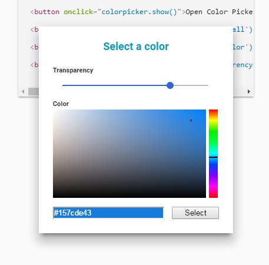

# Polymer Component: \<dialog-colorpicker\>

This is a simple color picking dialog that can be used to select a color and a transparency level.

You may create a dialog, open it via javascript and optionally pass in a initial color value. After confirming the selection, the dialog is closed and an event containing the hex coded RBGA value is fired. 

The code for the actual color picker is taken from FlexiColorPicker by DavidDurman (licensed under MIT License): https://github.com/DavidDurman/FlexiColorPicker



## Develop

Do you want to improve this component? Feel free to send pull requests afterwards.

### Install the Polymer-CLI

First, make sure you have the [Polymer CLI](https://www.npmjs.com/package/polymer-cli) installed. Then run `polymer serve` to serve your application locally.

### Viewing Your Application

```
$ polymer serve
```

### Building Your Application

```
$ polymer build
```

This will create a `build/` folder with `bundled/` and `unbundled/` sub-folders
containing a bundled (Vulcanized) and unbundled builds, both run through HTML,
CSS, and JS optimizers.

You can serve the built versions by giving `polymer serve` a folder to serve
from:

```
$ polymer serve build/bundled
```

## License

polymer-dialog-colorpicker is licensed under the MIT license:

Copyright (c) 2016 Benjamin Haettasch

Permission is hereby granted, free of charge, to any person obtaining a copy of this software and associated documentation files (the "Software"), to deal in the Software without restriction, including without limitation the rights to use, copy, modify, merge, publish, distribute, sublicense, and/or sell copies of the Software, and to permit persons to whom the Software is furnished to do so, subject to the following conditions:

The above copyright notice and this permission notice shall be included in all copies or substantial portions of the Software.

THE SOFTWARE IS PROVIDED "AS IS", WITHOUT WARRANTY OF ANY KIND, EXPRESS OR IMPLIED, INCLUDING BUT NOT LIMITED TO THE WARRANTIES OF MERCHANTABILITY, FITNESS FOR A PARTICULAR PURPOSE AND NONINFRINGEMENT. IN NO EVENT SHALL THE AUTHORS OR COPYRIGHT HOLDERS BE LIABLE FOR ANY CLAIM, DAMAGES OR OTHER LIABILITY, WHETHER IN AN ACTION OF CONTRACT, TORT OR OTHERWISE, ARISING FROM, OUT OF OR IN CONNECTION WITH THE SOFTWARE OR THE USE OR OTHER DEALINGS IN THE SOFTWARE.
